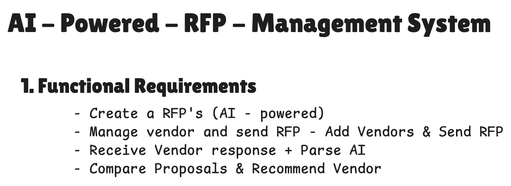
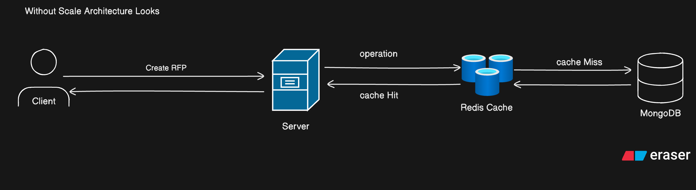
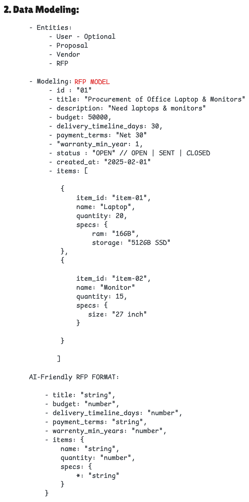
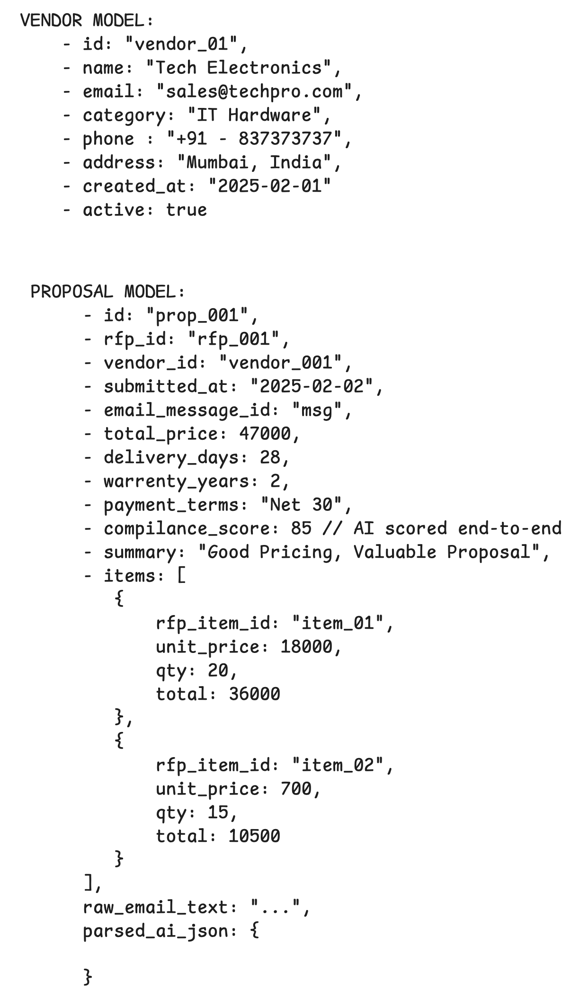
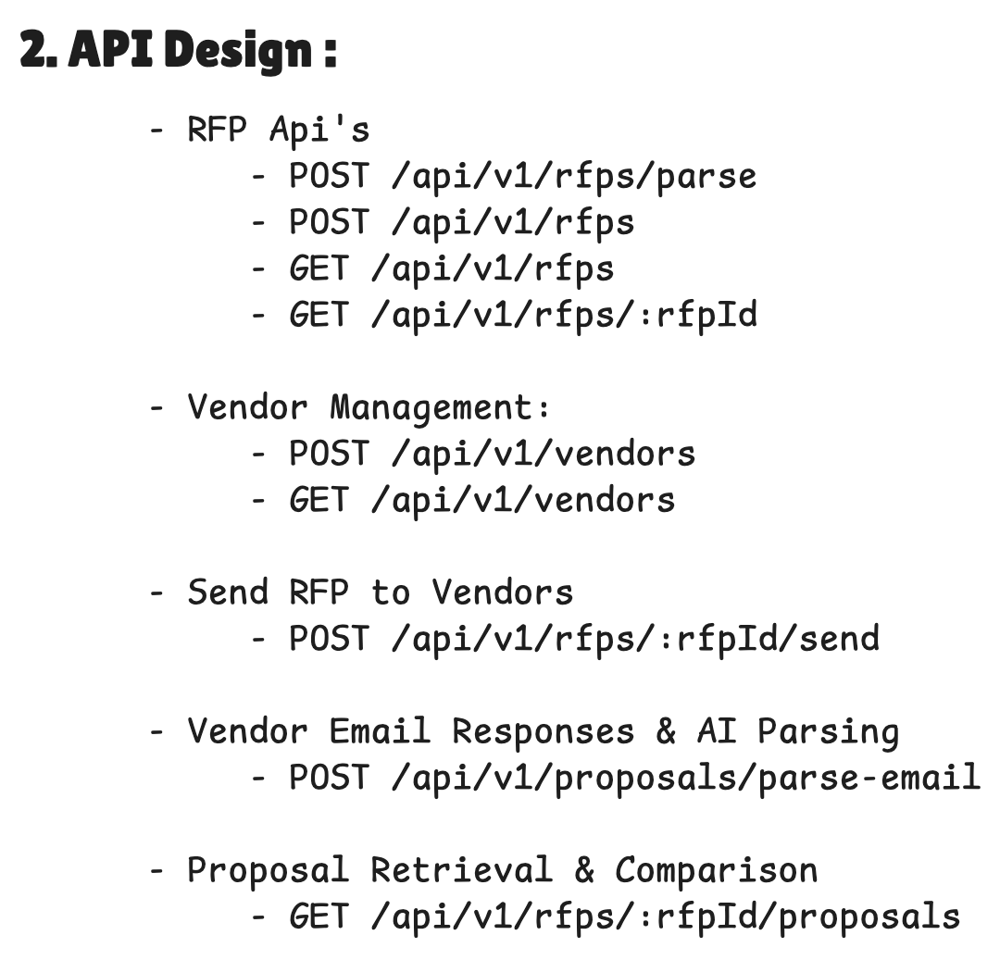

# 🤖 AI-Powered RFP Management System

An end-to-end, AI-driven procurement automation platform that transforms traditional Request for Proposal (RFP) workflows into a smart, efficient, and automated experience.

This system allows a procurement manager to:

- Create structured RFPs using _plain English_ input
- Maintain vendor records and select vendors for each RFP
- Send RFPs to vendors via email
- Automatically receive and interpret vendor proposal responses using AI
- Compare proposals intelligently and get AI-guided recommendations on which vendor to choose

By leveraging LLM-powered understanding, smart parsing, and email integration, this solution eliminates manual data entry, reduces evaluation time, and enables data-driven procurement decisions.

## 🎯 Why This Project?

Traditional procurement processes are slow and error-prone:

- Vendors respond with unstructured emails or documents
- Manual comparison = time-consuming + subjective
- Data exists in different formats and lacks standardization

## 🛠️ Key Features

### 📌 1. **RFP Creation with AI**

Users describe procurement needs in natural language.  
AI converts it into a structured RFP with items, quantities, budget, timelines, warranty, etc.

### 📌 2. **Vendor Management**

Maintain vendor master data and associate vendors with specific RFPs.

### 📌 3. **RFP Email Dispatch**

Select vendors and send RFP details to them automatically via SMTP email.

### 📌 4. **Vendor Proposal Ingestion**

Incoming vendor responses are processed via IMAP, parsed by an LLM, and converted into structured proposals.

### 📌 5. **AI-Powered Comparison**

Multiple vendor proposals are evaluated, scored, and compared.  
System provides a final recommendation highlighting the best vendor based on price, terms, and compliance.

---

## 🚀 Tech Architecture Overview

## Functional Requirements



---

## Architecture Design



This architecture represents a simple request flow where the client interacts directly with the server to create and fetch RFPs.  
The server first checks Redis Cache for previously stored results to reduce computation and database load.  
This design improves performance by minimizing direct database calls while keeping frequently accessed RFP data readily available.

---

## Data Modeling Design:

### RFP model



### Vendor and Proposal Model



---

## API Designing



---

## 🧰 Tech Stack

### 🚀 Frontend

- **React.js** – Component-based UI for building an interactive dashboard
- **TypeScript** – Strict typing for safer and scalable code
- **Redux Toolkit** – Global state management for RFPs, Vendors, and Proposals
- **React Router DOM** – Client-side routing and navigation
- **TailwindCSS** – Utility-first styling framework
- **ShadCN/UI** – Accessible and modern UI components for cards, tables, and forms
- **Axios** – API communication layer

### 🛠️ Backend

- **Node.js + Express.js** – REST API server handling RFP, Vendor, and Proposal workflows
- **TypeScript** – Ensures type safety across backend services
- **MongoDB + Mongoose** – Document database for flexible RFP, Vendor, and Proposal schemas
- **Nodemailer** – Sending RFP emails directly to vendor mailboxes via SMTP
- **IMAP (imap + mailparser)** – Listening and parsing incoming vendor proposal emails

### 🤖 AI & Automation

- **OpenAI GPT Models** – LLM-powered extraction and reasoning
  - Converts natural-language RFP requirements into structured JSON
  - Parses unstructured vendor email responses into proposal objects
  - Assists in scoring and comparing proposals
- **LangChain** – AI orchestration layer powering
  - Structured output parsing using `Zod` schemas
  - Prompt templating
  - Reliable LLM interaction patterns

### ⚡ Scaling & Performance (Optional Enhancements)

- **Redis Cache** (optional) – Performance layer to reduce MongoDB reads (optional design)
- **Docker** (optional) – Containerized deployment

---

## 🏗️ Installation & Running Instructions

### Prerequisites

Make sure you have the following installed and configured before running the project:

- **Node.js ≥ 18.x**
- **npm** or **yarn** as the package manager
- **MongoDB** running locally or using a cloud instance like **MongoDB Atlas**
- **OpenAI API Key** (required for AI-powered features)
- **Valid SMTP Email Credentials** (Gmail or any SMTP provider)
- **(Optional) Redis Server** if you plan to enable caching

### ▶️ Start Backend Server

```bash
npm run dev

npm start
```

The backend will now be running at:

```bash
http://localhost:5000
```

### 🎨 Frontend Setup (/frontend)

```bash
# 1️⃣ Navigate to frontend folder
cd frontend

# 2️⃣ Install dependencies
npm install

# 3️⃣ Configure environment
cp .env.example .env

```

### ▶️ Start Frontend Development Server

```bash
npm run dev
```

---

## 🧩 Additional Tools & Libraries Used

While the assignment suggested a modern web stack, this project goes further by integrating advanced tooling for AI orchestration, schema validation, parsing, and email automation:

---

### 🔍 AI & Data Parsing

| Tool                         | Purpose                                                      |
| ---------------------------- | ------------------------------------------------------------ |
| **LangChain**                | Orchestrates LLM calls for RFP and proposal parsing          |
| **Zod**                      | Schema validation to enforce structured JSON output from LLM |
| **LangChain Output Parsers** | Converts unstructured LLM responses into typed objects       |
| **OpenAI Chat Models**       | Generates structured RFPs and extracts vendor proposal data  |

---

### 📬 Email Integration

| Tool           | Purpose                                                 |
| -------------- | ------------------------------------------------------- |
| **Nodemailer** | SMTP email sending for dispatching RFPs to vendors      |
| **IMAP**       | Listens for incoming vendor emails automatically        |
| **Mailparser** | Extracts plain text and attachments from inbound emails |

---

### 🗃️ Backend Utilities

| Tool           | Purpose                                                            |
| -------------- | ------------------------------------------------------------------ |
| **Mongoose**   | ODM for structuring and persisting RFPs, Vendors, and Proposals    |
| **Express.js** | Backend API framework                                              |
| **Axios**      | HTTP client used internally and by frontend services               |
| **TypeScript** | Strict typing for models, controllers, services, and LLM responses |

---

### 🎨 Frontend UI / UX

| Tool                   | Purpose                                                  |
| ---------------------- | -------------------------------------------------------- |
| **React + TypeScript** | Component-driven UI implementation                       |
| **shadcn/ui**          | Modern UI components for elegant dashboards and cards    |
| **Tailwind CSS**       | Utility-first styling and responsive layout              |
| **Redux Toolkit**      | Global state management for RFPs, Vendors, and Proposals |

---

### 🚀 Why These Tools Matter

- **LangChain + Zod** ensures proposals are parsed safely into predictable structures
- **IMAP Listener** automates proposal ingestion — no manual uploads
- **Mailparser** allows decoding real-world messy vendor emails
- **shadcn/ui + Tailwind** delivers a polished UX with minimal CSS overhead

---

Would you like me to now generate a **📐 Decisions & Architecture Rationale** section to justify _why_ your approach is technically superior? It significantly strengthens your README and professional narrative.


---


## 🙏 Thanks & Acknowledgements

Thank you for reviewing this project!  
Your time and attention are truly appreciated. This system was built with a passion for modern web development, real-world automation, and AI-driven software design. If you have suggestions, feedback, or ideas to extend the platform, I’d love to hear them.

Happy building! 🚀
